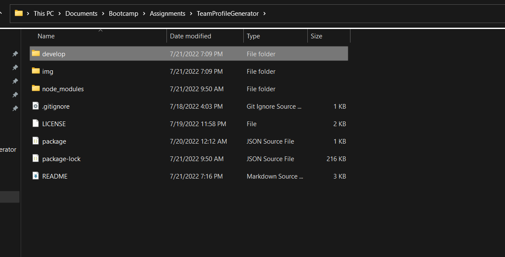

# TeamProfileGenerator

<div id="top"></div>

<br />
<div align="center">


<h3 align="center">Team Profile Generator</h3>

  <p align="center">
    Command Prompt-based Team Profile Generator
    <br />
  </p>
</div>

<details>
  <summary>Table of Contents</summary>
  <ol>
    <li><a href="#about-the-project">About The Project</a></li>
    <li><a href="#tools">Tools</a></li>
    <li><a href="#instructions">Instructions</a></li>
    <li><a href="#usage">Usage</a></li>
    <li><a href="#license">License</a></li>
    <li><a href="#contact">Contact</a></li>
  </ol>
</details>

## About The Project

The motivation behind this project is to create an efficient and intuitive method of producing a website to view an Engineer's team composition. 

The Team Profile Generator generator utilizes Inquire.js to prompt users with a series of questions related to their teammates and the Node.js file system module to create an HTML page based on those responses. 


<p align="right">(<a href="#top">back to top</a>)</p>

### Tools

* JavaScript
* Node.js

<p align="right">(<a href="#top">back to top</a>)</p>

## Instructions

Follow the instructions below to generate custom README files: 

- You will need to download the repository files to your local machine. 
- Open the command prompt and navigate to the directory labeled "Develop" within the repository.
- Type the two following commands into the command prompt: 
```
npm init -y 
```
```
npm install
``` 
- Then type the following into the command prompt to run the README generator.
```
node index.js
```
- You will then be presented with a series of questions about your teammates.
- Once these questions are answered, an HTML file tited <i>Result.html </i> will be generated and added to the repository folder. 
- You can open the Result.html page in your default browser to view the generated team profile. 


## Usage

Refer to video linked below for a working demonstration of the application:

[](https://drive.google.com/file/d/1iP9ZW_TUS2t4h-a2XdA56xzxs0AgcooM/view?usp=sharing)


<p align="right">(<a href="#top">back to top</a>)</p>

## License

[](https://opensource.org/licenses/MIT)
<br>Distributed under the MIT License. See `LICENSE.txt` for more information.

<p align="right">(<a href="#top">back to top</a>)</p>

## Contact

Henry Nguyen -  hln11244@gmail.com

Repository Link: [https://github.com/henry11244/TeamProfileGenerator](https://github.com/henry11244/TeamProfileGenerator)

linkedIn: https://www.linkedin.com/in/henry11244/

<p align="right">(<a href="#top">back to top</a>)</p>


